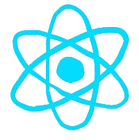

# Hey there  

I'm Tejas, a Computer Engineering student.

I build, break, and learn through code.  
If I can think it, I try to build it.

### 🛠 Tech Stack

  
  
  
  
  
  
  
  

### Currently

Mastering web development  
Building backend systems and MERN stack projects  

### ⚡ Fun Facts

- I prefer building over watching tutorials  
- Always trying to level up  
